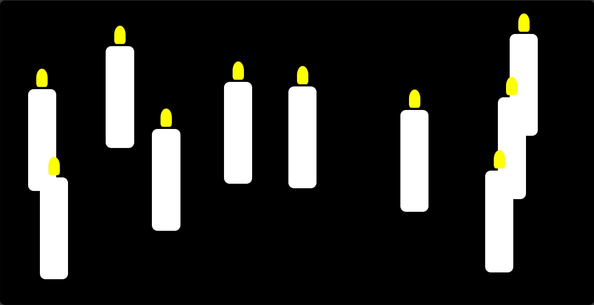

# 蜡烛燃烧效果网页

这个网页使用 HTML 和 CSS 实现了一个蜡烛燃烧的效果。页面中有 10 个蜡烛，每个蜡烛都有一个火焰效果，通过 CSS 动画使其看起来像是在燃烧。

## 功能

- 显示 10 个蜡烛在燃烧的效果
- 每个蜡烛都有一个火焰效果，通过 CSS 动画模拟火焰的摇曳
- 背景为黑色，增强蜡烛燃烧的视觉效果

## 使用方法

1. 克隆或下载本仓库到本地。
2. 确保你的计算机上安装了一个文本编辑器和一个 Web 浏览器。
3. 在文本编辑器中打开 `index.html` 文件。
4. 如果你有火焰的 PNG 图像，请将其命名为 `flame.png` 并放在与 `index.html` 相同的目录下。如果没有，你可以使用提供的默认火焰图像。
5. 在浏览器中打开 `index.html` 文件，即可看到蜡烛燃烧的效果。

## 自定义

你可以根据自己的喜好自定义蜡烛和火焰的样式。以下是一些可能的修改点：

- 调整蜡烛的颜色、大小和间距。
- 修改火焰的颜色、大小和动画效果。
- 改变背景颜色或添加背景图像。
- 增加或减少蜡烛的数量。

## 贡献

欢迎贡献代码，改进这个项目。如果你有任何问题或建议，请提交一个 Issue 或 Pull Request。
